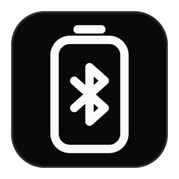
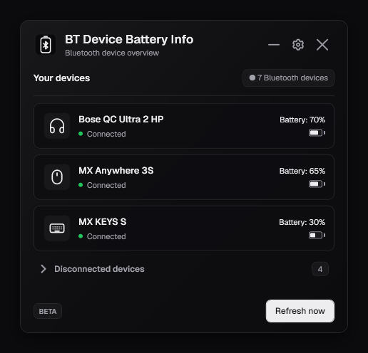
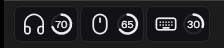
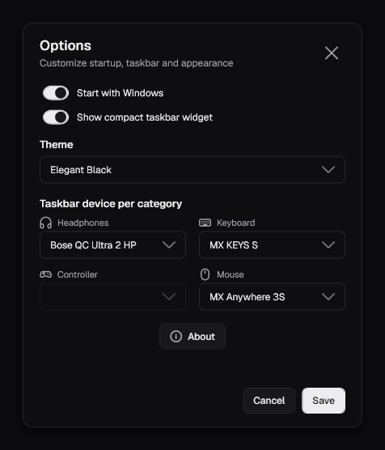
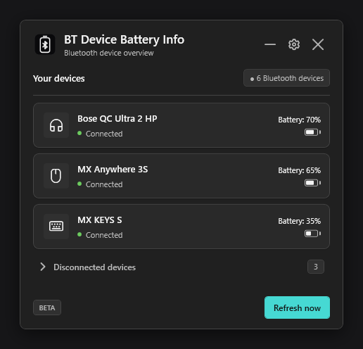
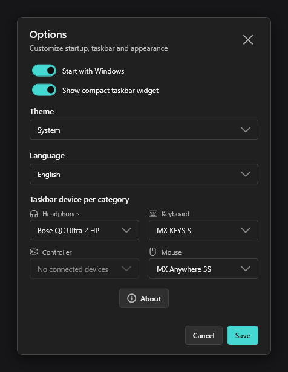
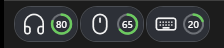
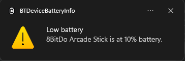
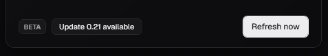

<div align="center">
  

  <h1>BT Device Battery Info</h1>

  <a href="https://github.com/borferkic/BT-Device-Battery-Info/releases/latest"></a>
  <a href="https://github.com/borferkic/BT-Device-Battery-Info/releases"></a>
  
  <a href="LICENSE"></a>
  <br />
  <a href="https://paypal.me/borissdk"></a>
  <a href="https://patreon.com/borissdk"></a>

  <p><a href="#english">English</a> | <a href="#espanol">Español</a></p>
</div>

<a id="english"></a>

**A lightweight, read-only Windows widget that shows your Bluetooth devices and their battery level, right from the system tray and the taskbar.**

Latest release: `0.22` — **Low battery alerts and update notice**.

<div align="center">
  
  <br />
  
</div>

---

## Features

- **Devices and battery**
  - Detects paired and connected Bluetooth Classic and Bluetooth Low Energy (BLE) devices, with their name, category icon, and connection state.
  - Shows battery percentage through Windows PnP properties or the standard GATT Battery Service when available.
  - Groups the endpoints of the same physical device and keeps devices with the same name separate when they have different Windows identities.
  - Shows loading placeholders during the initial scan and a clear message when no devices are available.
  - Reads the battery of wireless game controllers in X-input mode over Bluetooth through Windows.Gaming.Input (for example, the 8BitDo Arcade Stick).
  - `Refresh now` in the widget and system tray refreshes devices and triggers a new battery query.
- **Taskbar widget**
  - Compact battery indicators for connected headphones, keyboards, mice, and controllers on the left side of the Windows taskbar.
  - Choose which device is shown for each category, from `Options` or by clicking an indicator.
  - Battery ring states: theme color for a normal level, **red** at 15 % or less, and `–` when the device does not report battery.
- **Themes**
  - **Elegant Black**: a monochrome dark theme inspired by shadcn/ui, with the Geist Sans font and a subtle gradient on the main window.
  - **System**: follows the Windows 11 look, uses the Windows device icons, and switches automatically between light and dark mode when Windows changes.
  - The theme applies to every window, tooltip, menu, and the taskbar widget, with a live preview in `Options`, plus light and dark app icons.
- **Application**
  - `Options` window with switches for Start with Windows and the taskbar widget, the theme and language selectors, and the device per category.
  - English and Spanish interface, switchable live from `Options`.
  - Windows notification when a device drops to the low-battery threshold (configurable in `Options`, 15 % by default).
  - Notice at startup when a newer version is available on GitHub, with a button that opens its release page.
  - Detects when Bluetooth is off or the adapter is disabled, with a `Turn on Bluetooth` button and a shortcut to Bluetooth settings.
  - Tray actions to show or hide the widget, enable or disable Start with Windows, refresh, and exit.
  - Single instance: the app informs you when it is already running.
  - Keyboard navigation with a visible focus ring.

## Screenshots

**Elegant Black theme**

| Main window | Options |
|---|---|
|  |  |

**System theme (Windows 11 dark)**

| Main window | Options |
|---|---|
|  |  |



**Low battery notification**



**Update notice**



## Quick start

1. Open the [latest release](https://github.com/borferkic/BT-Device-Battery-Info/releases/latest).
2. Under **Assets**, download `BTDeviceBatteryInfo.exe`.
3. Run it. The app starts in the system tray; use the tray icon to show the widget.

The release is self-contained and does not require the .NET Desktop Runtime.

> [!IMPORTANT]
> The executable is not code-signed yet, so Windows SmartScreen may show
> "Windows protected your PC". Select **More info → Run anyway** to start the app.

> [!NOTE]
> Battery levels are shown only when the device and Windows report them.
> Some headphones, keyboards, or older devices may appear without a percentage.

## Requirements

- Windows 10 version 19041 or later, or Windows 11.
- A Bluetooth adapter and paired Bluetooth devices. Battery reporting depends on the device, profile, driver, and information exposed by Windows.

## How it works

```text
┌──────────────────────────────────────────────────────────────────┐
│                     Windows Bluetooth stack                      │
└───────────────────────────────┬──────────────────────────────────┘
                                ▼
┌──────────────────────────────────────────────────────────────────┐
│ BluetoothService — DeviceWatcher (Classic + BLE endpoints)       │
│ Groups endpoints of the same device by ContainerId               │
└───────────────┬─────────────────────────────────┬────────────────┘
                ▼                                 ▼
┌───────────────────────────────┐ ┌────────────────────────────────┐
│ PnP / HFP battery (CfgMgr32)  │ │ GATT Battery Service           │
│ DEVPKEY_Bluetooth_BatteryLevel│ │ 0x180F / 0x2A19 (BLE)          │
└───────────────┬───────────────┘ └───────────────┬────────────────┘
                └────────────────┬────────────────┘
                                 ▼
┌──────────────────────────────────────────────────────────────────┐
│ MainViewModel — selection, refresh, and state                    │
└──────┬─────────────────────────┬──────────────────────────┬──────┘
       ▼                         ▼                          ▼
  Main window             Taskbar widget               System tray
```

Connected devices are prioritized in the list. Some devices may appear without a battery percentage because their hardware or driver does not expose it.

## Privacy and safety

- **Read-only**: the app does not remove pairings, disable adapters, simulate connections, or modify device drivers.
- **No telemetry**: no analytics. The only network request is a single check of the latest release on GitHub at startup; no data about you or your devices is sent, and nothing is downloaded automatically.
- **Local data only**: settings and diagnostic logs are stored in `%LocalAppData%\BTDeviceBatteryInfo`.

## Build and run

From the repository root:

```powershell
dotnet restore ".\BT Device Battery Info.slnx"
dotnet build ".\BT Device Battery Info.slnx" --configuration Release
dotnet run --project ".\BTDeviceBatteryInfo\BTDeviceBatteryInfo.csproj" --configuration Release
```

To publish a self-contained Windows x64 executable:

```powershell
dotnet publish ".\BTDeviceBatteryInfo\BTDeviceBatteryInfo.csproj" `
  --configuration Release `
  --runtime win-x64 `
  --self-contained true `
  -p:PublishSingleFile=true `
  -p:IncludeNativeLibrariesForSelfExtract=true `
  --output ".\publish\win-x64"
```

Developers need the .NET 8 SDK or Visual Studio 2022 with the .NET desktop development workload.

## Project structure

```text
.
├── BT Device Battery Info.slnx
├── BTDeviceBatteryInfo/
│   ├── Assets/          # Icons, fonts, and third-party licenses
│   ├── Models/          # Device and application data models
│   ├── Resources/       # WPF styles, themes, and interface strings (XAML)
│   ├── Services/        # Bluetooth, battery, settings, logging, themes, and language
│   ├── ViewModels/      # UI state and commands
│   ├── Views/           # Windows and the taskbar widget
│   ├── docs/            # Architecture, testing, backlog, and research
├── tests/               # Validation projects
├── .github/workflows/   # Windows continuous integration
├── CONTRIBUTING.md
└── LICENSE
```

## License and contributing

BT Device Battery Info is distributed under the MIT License. See [LICENSE](LICENSE) for the complete license text.

Contributions, bug reports, and improvements are welcome. See [CONTRIBUTING.md](CONTRIBUTING.md) for development guidelines and [CHANGELOG.md](CHANGELOG.md) for release notes. The project documentation is organized in [BTDeviceBatteryInfo/docs/README.md](BTDeviceBatteryInfo/docs/README.md).

## Support the project

If you like BT Device Battery Info and find it useful, you can support its development through **[PayPal](https://paypal.me/borissdk)** or **[Patreon](https://patreon.com/borissdk)**. Thank you for helping keep the project moving forward.

<a href="https://paypal.me/borissdk"></a>
<a href="https://patreon.com/borissdk"></a>

---

<a id="espanol"></a>

## Español

**Un widget ligero y de solo lectura para Windows que muestra tus dispositivos Bluetooth y su nivel de batería, desde el área de notificaciones y la barra de tareas.**

Última versión: `0.22` — **Avisos de batería baja y de nuevas versiones**.

### Funcionalidades

- **Dispositivos y batería**
  - Detecta dispositivos Bluetooth Classic y Bluetooth Low Energy (BLE) emparejados o conectados, con su nombre, icono de categoría y estado de conexión.
  - Muestra el porcentaje de batería mediante propiedades PnP de Windows o el servicio estándar GATT Battery Service cuando está disponible.
  - Agrupa los endpoints de un mismo dispositivo físico y mantiene separados los dispositivos con el mismo nombre cuando tienen identidades diferentes en Windows.
  - Muestra marcadores de carga durante la búsqueda inicial y un mensaje claro cuando no hay dispositivos.
  - Lee la batería de mandos inalámbricos en modo X-input por Bluetooth mediante Windows.Gaming.Input (por ejemplo, el 8BitDo Arcade Stick).
  - `Refresh now`, en el widget y el área de notificaciones, actualiza los dispositivos y vuelve a consultar la batería.
- **Widget de la barra de tareas**
  - Indicadores compactos de batería para auriculares, teclados, mouse y controles conectados en el lado izquierdo de la barra de tareas.
  - Permite elegir qué dispositivo se muestra en cada categoría, desde `Options` o haciendo clic en un indicador.
  - Estados del anillo: color del tema con nivel normal, **rojo** con 15 % o menos y `–` cuando el dispositivo no reporta batería.
- **Temas**
  - **Elegant Black**: tema oscuro monocromo inspirado en shadcn/ui, con la fuente Geist Sans y un gradiente sutil en la ventana principal.
  - **System**: sigue el aspecto de Windows 11, usa los iconos de dispositivos de Windows y cambia automáticamente entre modo claro y oscuro cuando cambia Windows.
  - El tema se aplica a todas las ventanas, tooltips, menús y al widget, con vista previa en vivo en `Options` e iconos de la app en versión clara y oscura.
- **Aplicación**
  - Ventana `Options` con interruptores para el inicio con Windows y el widget, los selectores de tema e idioma, y el dispositivo por categoría.
  - Interfaz en inglés y español, con cambio en vivo desde `Options`.
  - Notificación de Windows cuando un dispositivo baja del umbral de batería (configurable en `Options`, 15 % por defecto).
  - Aviso al abrir la aplicación cuando hay una versión nueva en GitHub, con un botón que abre su página de descarga.
  - Detecta cuando Bluetooth está apagado o el adaptador deshabilitado, con un botón `Turn on Bluetooth` y un acceso a la configuración de Bluetooth.
  - Opciones en el área de notificaciones para mostrar u ocultar el widget, activar o desactivar el inicio con Windows, actualizar y salir.
  - Instancia única: avisa si la aplicación ya está abierta.
  - Navegación con teclado con un anillo de foco visible.

### Capturas

**Tema Elegant Black**

| Ventana principal | Opciones |
|---|---|
|  |  |


**Tema System (Windows 11 oscuro)**

| Ventana principal | Opciones |
|---|---|
|  |  |


**Aviso de batería baja**


**Aviso de nueva versión**


### Inicio rápido

1. Abre la [última versión](https://github.com/borferkic/BT-Device-Battery-Info/releases/latest).
2. En **Assets**, descarga `BTDeviceBatteryInfo.exe`.
3. Ejecútalo. La aplicación se inicia en el área de notificaciones; usa su icono para mostrar el widget.

La versión publicada es autocontenida y no requiere el .NET Desktop Runtime.

> [!IMPORTANT]
> El ejecutable todavía no está firmado, por lo que Windows SmartScreen puede mostrar
> "Windows protegió tu PC". Selecciona **Más información → Ejecutar de todas formas** para iniciar la aplicación.

> [!NOTE]
> El nivel de batería solo se muestra cuando el dispositivo y Windows lo reportan.
> Algunos auriculares, teclados o dispositivos antiguos pueden aparecer sin porcentaje.

### Requisitos

- Windows 10 versión 19041 o posterior, o Windows 11.
- Un adaptador Bluetooth y dispositivos Bluetooth emparejados. La información de batería depende del dispositivo, el perfil, el controlador y los datos que Windows exponga.

### Privacidad y seguridad

- **Solo lectura**: la aplicación no elimina emparejamientos, no desactiva adaptadores, no simula conexiones ni modifica controladores.
- **Sin telemetría**: sin analíticas. La única conexión de red es una consulta de la última versión en GitHub al abrir la aplicación; no se envían datos tuyos ni de tus dispositivos y no se descarga nada automáticamente.
- **Datos locales**: la configuración y los registros se guardan en `%LocalAppData%\BTDeviceBatteryInfo`.

### Compilar y ejecutar

Desde la raíz del repositorio:

```powershell
dotnet restore ".\BT Device Battery Info.slnx"
dotnet build ".\BT Device Battery Info.slnx" --configuration Release
dotnet run --project ".\BTDeviceBatteryInfo\BTDeviceBatteryInfo.csproj" --configuration Release
```

Para publicar un ejecutable independiente para Windows x64:

```powershell
dotnet publish ".\BTDeviceBatteryInfo\BTDeviceBatteryInfo.csproj" `
  --configuration Release `
  --runtime win-x64 `
  --self-contained true `
  -p:PublishSingleFile=true `
  -p:IncludeNativeLibrariesForSelfExtract=true `
  --output ".\publish\win-x64"
```

Para compilar se necesita el .NET 8 SDK o Visual Studio 2022 con la carga de trabajo de desarrollo de escritorio .NET.

### Licencia y contribuciones

BT Device Battery Info se distribuye bajo la licencia MIT. Consulta el archivo [LICENSE](LICENSE) para ver el texto completo.

Las contribuciones, reportes de errores y mejoras son bienvenidos. Consulta [CONTRIBUTING.md](CONTRIBUTING.md) y [CHANGELOG.md](CHANGELOG.md) para ver las notas de versión.

### Apoya el proyecto

Si te gusta BT Device Battery Info y te resulta útil, puedes apoyar su desarrollo mediante **[PayPal](https://paypal.me/borissdk)** o **[Patreon](https://patreon.com/borissdk)**. Gracias por ayudar a que el proyecto siga avanzando.

<a href="https://paypal.me/borissdk"></a>
<a href="https://patreon.com/borissdk"></a>
